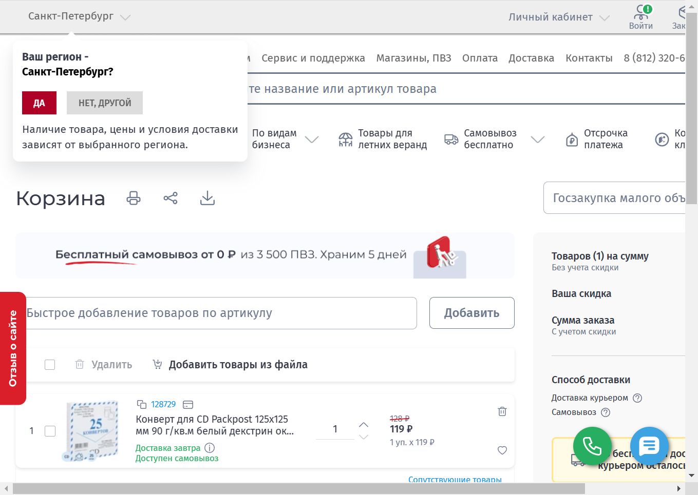
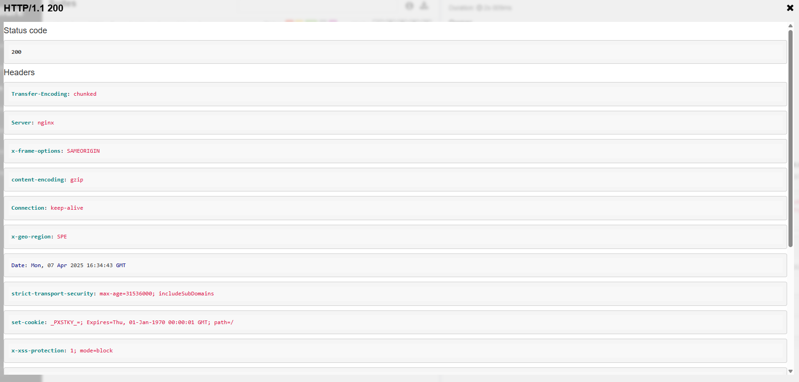
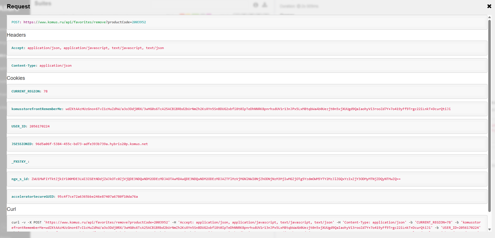
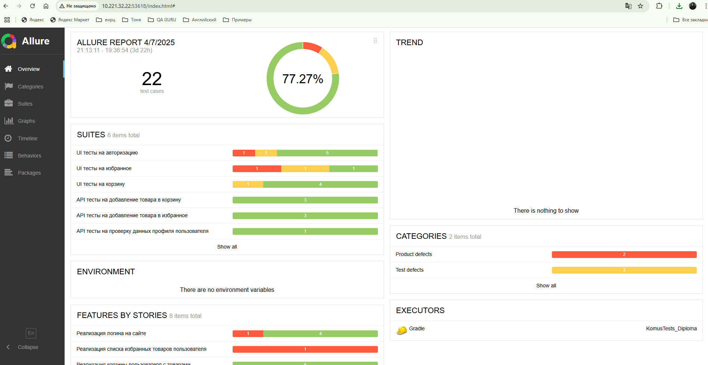
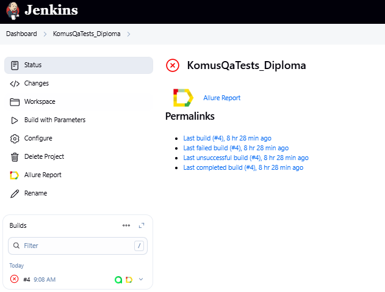
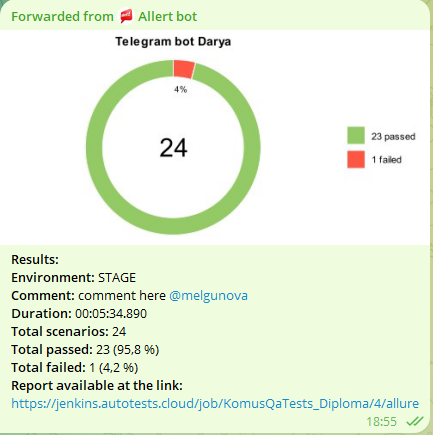
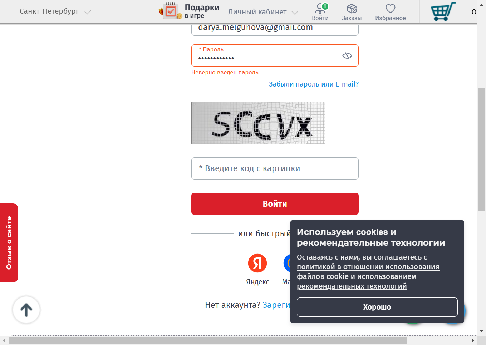
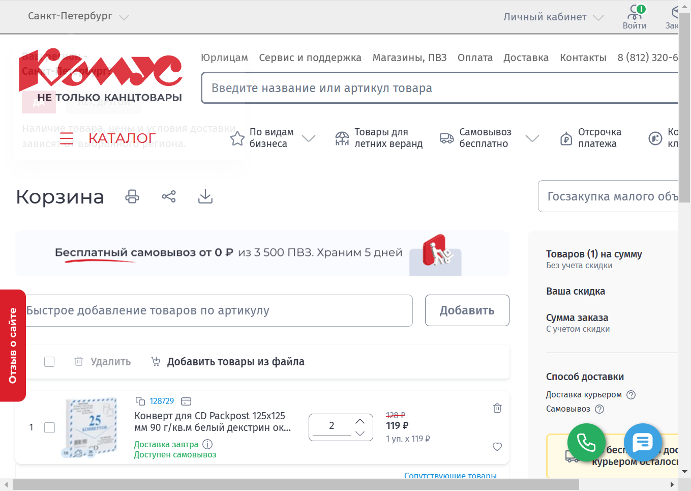
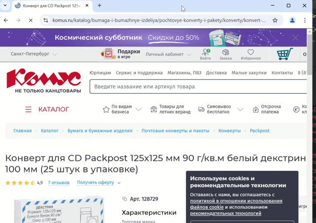

# Проект с автотестами на Java для комании Комус


> «Ко́мус» — российская рознично-торговая компания, являющаяся лидером на российском рынке канцелярских и офисных
> товаров, и одним из крупнейших поставщиков бумаги, картона и пластиковой упаковки в России.

Автотесты разработаны для [веб-сайта компании](https://www.komus.ru/)

## Покрытие сайта https://www.komus.ru/ тестами предоставляет множество преимуществ для бизнеса и пользователей. Вот основные из них:

1. **Обеспечение стабильности и надежности**: Тесты помогают выявить баги на ранних стадиях разработки или обновления
   сайта, предотвращая их попадание в продакшн.

2. **Улучшение пользовательского опыта (UX)**: Автоматизированное тестирование производительности помогает выявить узкие
   места и оптимизировать сайт.

3. **Соответствие законодательным и отраслевым требованиям**: Тесты проверяют корректную работу на разных устройствах,
   браузерах и операционных системах.

4. **Экономия времени и ресурсов**: Чем раньше найдена ошибка, тем дешевле и быстрее её исправить.

## Стэк:

<p align="center">  
<a href="https://www.jetbrains.com/idea/"></a>  
<a href="https://www.java.com/"></a>  
<a href="https://github.com/"></a>  
<a href="https://junit.org/junit5/"></a>  
<a href="https://gradle.org/"></a>  
<a href="https://selenide.org/"></a>  
<a href="https://aerokube.com/selenoid/"></a>
<a href="https://allurereport.org/"></a>
<a href="https://www.jenkins.io/"></a>  
<a href="https://rest-assured.io/"></a>  
<a href="https://qameta.io/"></a>  
</p>

Тесты написаны на языке Java с использованием фреймворков Selenide, JUnit5 и системы сборки Gradle. В api-тестах
используется библиотека Rest Assured. Для параметризации сборки используется библиотека Owner.

CI/CD проходит через Jenkins, тесты запускаются на Selenoid. Тестовая отчетность формируется в Allure Reports. После
завершения прогона отправляются уведомления с помощью бота в Telegram.

## Автоматизированные тест-кейсы:

### Web-тесты

- [x] Проверка добавления/удаления товара в корзине
- [x] Проверка увеличения/уменьшения количества товара в корзине
- [x] Проверка добавления/удаления товара в избранное
- [x] Проверка успешной/неуспешной авторизации на сайте
- [x] Проверка добавления товара в избранное
- [x] Проверка появления окна с captcha, если есть больше 1 неудачной попытки входа

### Api-тесты:

- [x] Проверка добавления/удаления товара в корзине
- [x] Проверка очистки корзины
- [x] Проверка добавления/удаления товара в избранное
- [x] Проверка получения списка избранных товаров
- [x] Проверка данных профиля пользователя
- [x] Проверка авторизации пользователя на сайте

### Api-тесты:





## Allure отчет (https://jenkins.autotests.cloud/job/KomusQaTests_Diploma/allure/):

## Интеграция с Allure TestOps (https://allure.autotests.cloud/launch/45684)



## Cборка в [Jenkins](https://jenkins.autotests.cloud/job/KomusQaTests_Diploma/):



**Сборку можно собрать с параметрами:**

* <code>BROWSER</code> – браузер для выполнения тестов
* <code>BROWSER_SIZE</code> – размер окна браузера
* <code>BROWSER_VERSION</code> – версия браузера (в зависимости от выбранного браузера)
* <code>SELENOID_HOST</code> – адрес удаленного сервера для запуска тестов
* <code>BASE_URL</code> – вызываемый урл
* <code>ENVIRONMENT</code> – окружение для запуска тестов
* <code>COMMENT</code> – комментарий для отчета в тг

### Команды для запуска сборки из терминала:

**Сборка на удаленном Selenoid с параметрами, которые указаны в Jenkins, как для всего проекта, так и для API и WEB
тестов:**

```
clean test -Denv=remote -DisRemote=true -Demail=$email -Dpassword=$password
clean api -Denv=remote -DisRemote=true -Demail=$email -Dpassword=$password
clean web -Denv=remote -DisRemote=true -Demail=$email -Dpassword=$password

```

### После выполнения сборки в телеграм-бот придет отчет:



### Для каждого теста сохранится скриншот и видео с результатом:








